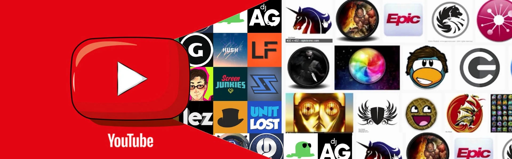
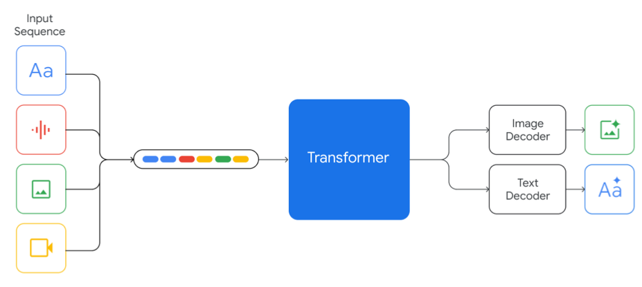
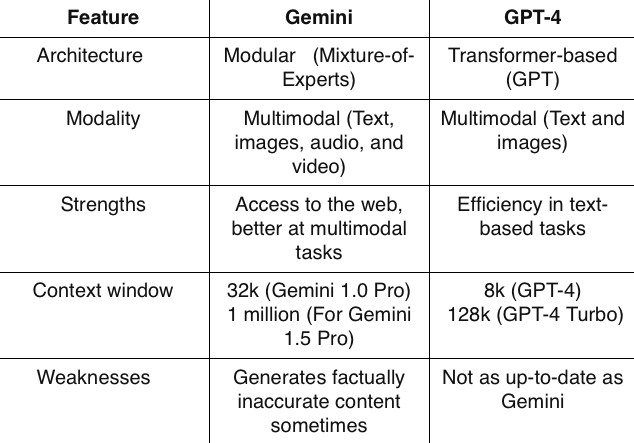

# Using Gemini Pro To Build a YouTube-Video-Summarizer App

## Overview

The YouTube Video Summarizer is a solution designed to enhance the learning and content review experience for users frequently engaging with YouTube videos. This project leverages the power of Streamlit to offer a user-friendly web interface where users can input YouTube video links and receive concise, AI-generated summaries of the video content. By extracting video transcripts and utilizing Google's  Gemini Pro generative AI model, this tool simplifies the consumption of lengthy videos, making it invaluable for students, professionals, and casual learners alike.

## How It Works

1. Input: Users enter a YouTube video link through the Streamlit web interface.
2. Transcript Extraction: The script extracts the transcript of the video using the YouTube Transcript API.
3. Summary Generation: Google's Gemini Pro model processes the transcript with a predefined prompt to generate a summary that highlights key points in 250 words or less.
4. Display: The summary is then presented to the user, offering a quick and insightful overview of the video's content.

## Model Architecture of Gemini Pro

Gemini models are advanced multimodal systems that integrate multiple types of inputs to produce both textual and visual outputs.

Input Sequence: The Gemini model accepts various input types which are represented by different colored icons:
1. Text (blue)
2. Audio (red)
3. Visuals such as images, charts, screenshots, PDFs, and videos (green)
4. Other forms which could be various document types or mixed media (yellow)
   
Transformer Core: This is the central processing unit of the model which is based on the Transformer architecture (originally proposed by Vaswani et al., 2017b). The Gemini models make improvements to this architecture to enable scaling and efficient processing. They support a large context window of 32k tokens and employ mechanisms such as multi-query attention.

Output Decoders: After processing the inputs, the Transformer core can produce two types of outputs through separate decoders:
Image Decoder: Outputs visual content, likely using discrete image tokens inspired by works like DALL-E (Ramesh et al., 2021).
Text Decoder: Outputs textual content.

The model architecture is flexible enough to handle a sequence of inputs that includes text, images, audio, and video (as seen in Figure 2 from your description). It can output responses with interleaved images and text, reflecting a deep understanding of the input media.

The text description accompanying the image suggests that Gemini models draw on foundational work from other multimodal models like Flamingo, CoCa, and PaLI. They are distinct in that they are multimodal from the outset and can natively output images.

For video, Gemini models can encode it frame-by-frame in a large context window, allowing for a nuanced understanding of the video content. With audio, they can directly process 16kHz audio features from the Universal Speech Model (USM), capturing subtleties often missed when converting audio to text.

The training of Gemini models represents significant innovation in training algorithms, datasets, and infrastructure, with different model sizes optimized for various tasks, including on-device experiences. The Pro model leverages scalability for efficient pre-training, while the Nano series uses advancements in distillation and training for compact, yet powerful, language models.

## Gemini vs ChatGPT: Key Differences

Gemini’s strengths:

Better at combining text, images, video, and other formats (multimodal tasks)
Generates up-to-date content 
The most advanced Gemini model has a content window of 1 million tokens
Gemini will produce multiple responses to queries you pose to it, which you can access by pressing “View Drafts.

GPT-4’s strengths: 

More efficient and accurate at language tasks
Edges out Gemini in tests of language understanding and common sense. ChatGPT can learn from the conversations it has with people and “hold context”, whereas Gemini does this in a much more limited way at the moment.
Generates safer and less biased content
Has better speech recognition than Gemini

## Youtube-transcript-api

This is an python API which allows you to get the transcripts/subtitles for a given YouTube video. It also works for automatically generated subtitles, supports translating subtitles and it does not require a headless browser, like other selenium based solutions do!

## Critical Analysis

The YouTube Video Summarizer stands at the intersection of content accessibility and AI, showcasing how machine learning can be harnessed to distill vast amounts of information into digestible summaries. This project underscores the potential of AI in educational technology, providing a gateway to more efficient learning and content review. However, the reliance on AI-generated summaries also raises questions about accuracy and the potential for missing nuanced information. 

Future iterations could explore integrating user feedback mechanisms to improve summary quality and exploring model transparency and interpretability.

## Next Steps

1. Tailor the output to align with the user's background. For instance, if a user pastes a URL link to a statistics video and has no prior experience in statistics, they should have the option to adjust the complexity of the summary provided by the model based on their understanding.
2. Expand the summarization capabilities to include multi-language support.
3. Explore integration with other video platforms and content formats.

## Resource Links

Streamlit Documentation
Google Gemini Pro API Guide
YouTube Transcript API
Papers With Code - For the latest research on text summarization and AI models.
